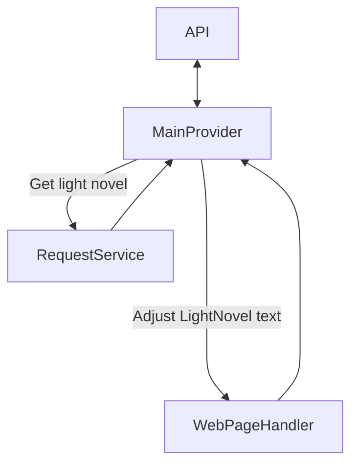
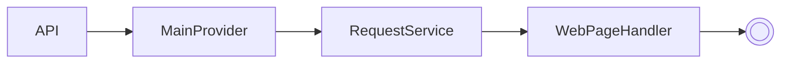

# Novelbin_extension

This project is being developed for academic purposes and aims to improve the concepts of the .NET (C#) language and software architecture.

## Concept

The idea of this project is to extract the LightNovels from the 'https://novelbin.me/' page.

### Architecture

This project is being developed using hexagonal architecture. It currently consists of 2 projects, namely:
#### src:
- **API** => Responsible for communicating with other components and returning the searched data.
- **Core** => Responsible for containing the business rules for how the solution will retrieve data.
#### tests:
- **API.Tests** => Responsible for ensuring the operation of the API project.
- **Core.Tests** => Responsible for ensuring the operation of the Core project.

### Contract rule.
To ensure that this project will communicate seamlessly with the main application, this solution must implement the [Atomikku_Model_extension](https://github.com/Atomikku-Extensions/Atomikku_Model_extension) contract.