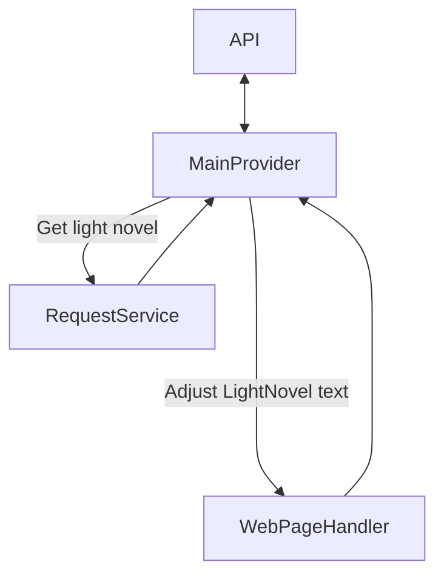
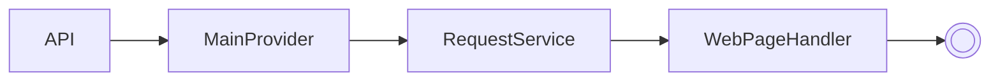

# Novelbin_extension 🍡🏯🍙

This project is being developed for academic purposes and aims to improve the concepts of the .NET (C#) language and software architecture.

## Concept 🎨🖼️

The idea of this project is to extract the LightNovels from the 'https://novelbin.me/' page.

### Architecture 🏗️

This project is being developed using hexagonal architecture. It currently consists of 2 projects, namely:
#### src:
- **API** => Responsible for communicating with other components and returning the searched data.
- **Core** => Responsible for containing the business rules for how the solution will retrieve data.
#### tests:
- **API.Tests** => Responsible for ensuring the operation of the API project.
- **Core.Tests** => Responsible for ensuring the operation of the Core project.

```
  flowchart TB
    API <--> MainProvider
    MainProvider --Get light novel--> RequestService
    RequestService -->
    MainProvider --Adjust LightNovel text----> WebPageHandler
    WebPageHandler --> MainProvider
```



```
flowchart LR
  API --> MainProvider --> RequestService --> WebPageHandler --> E((( )))
```



### Contract rule 🗒️
To ensure that this project will communicate seamlessly with the main application, this solution must implement the [Atomikku_Model_extension](https://github.com/Atomikku-Extensions/Atomikku_Model_extension) contract.

### Inspiration💡
This project was inspired by the [Tachiyomi](https://tachiyomi.org/) application, which is also open source. The difference with this project is that it must be scalable and multiplatform.

## FAQ ⁉️

#### Why was this architecture chosen?
The hexagonal architecture was chosen due to the need to build an application that separates the business logic from the other components. This ensures that this project can be scalable without its functionality being affected.

#### How important is it to separate the business logic from the API?
The 'Core' project was created to contain the business logic of this application. This ensures that, if it is necessary to create another project as an interface for this application (such as Windows Forms, Console or Web), operation will not be affected.

#### Why was an API created to perform the interaction?
An API was created as a means of interacting with this project because, even if an application (Android or IOS), WebAPI or Windows Program is created completely decoupled, it can easily make use of this API without having to create a complex structure that allows communication between applications.
	
## Skills acquired in this project

✅ Manipulation of components of an external web page (HTML).

## Features implemented

- [x] Get books from a search
- [ ] Get a selected book
- [ ] Get chapters from the selected book
- [ ] Extract main books from home menu
- [ ] Get books from the filter
